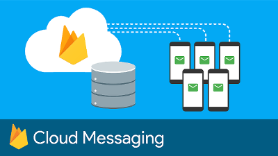
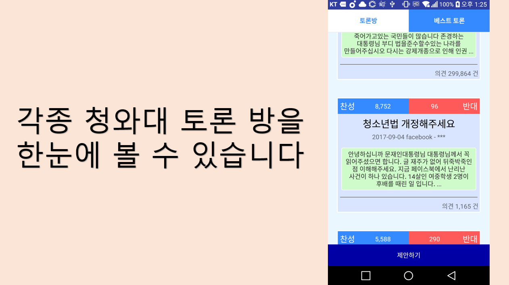
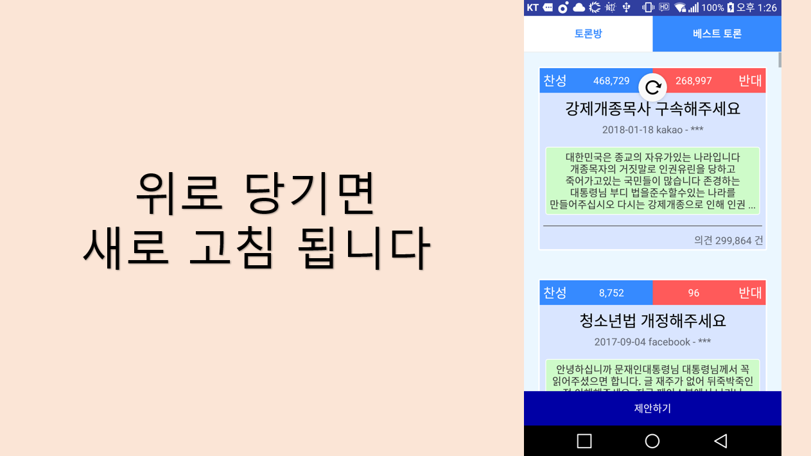
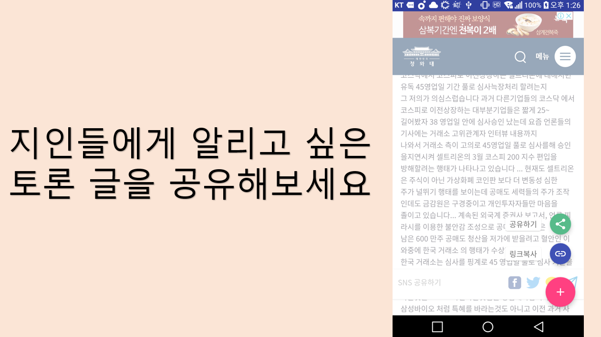

# 청와대 국민토론 - Android

앱 이름 : 청와대 국민토론

사용 용도 :  청와대 토론방을 모바일로 간편하게 사용할 수 있다.

사용 언어 : java

사용 IDE : android studio

사용 라이브러리 : Jsoup, firebase(FCM)

저작권 정책 : 본 저작물은 '청와대 홈페이지'에서 작성하여 공공누리 제1유형으로 개방한 '토론방'을 이용하였으며, 해당 저작물은 '청와대 홈페이지,https://www1.president.co.kr/fourms?page=1#_=_에서 무료로 열람하실 수 있습니다.

---

## How to Use?

(참고로 구글 광고ID는 테스트용으로 했고 google-service.json파일은 비워놨습니다!!)
